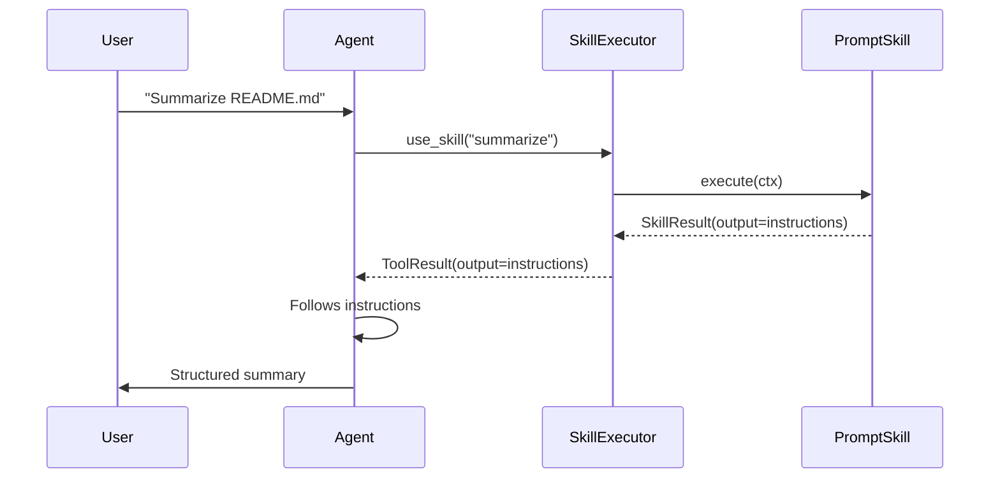
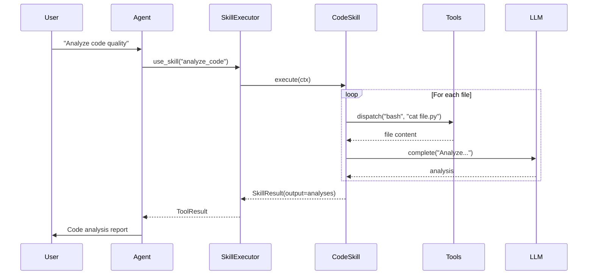
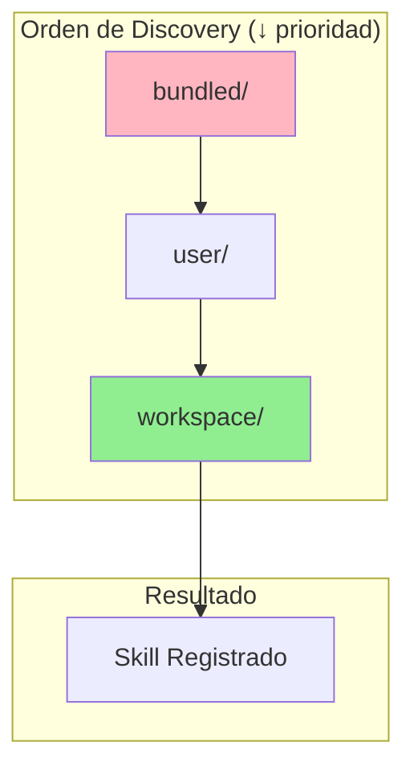
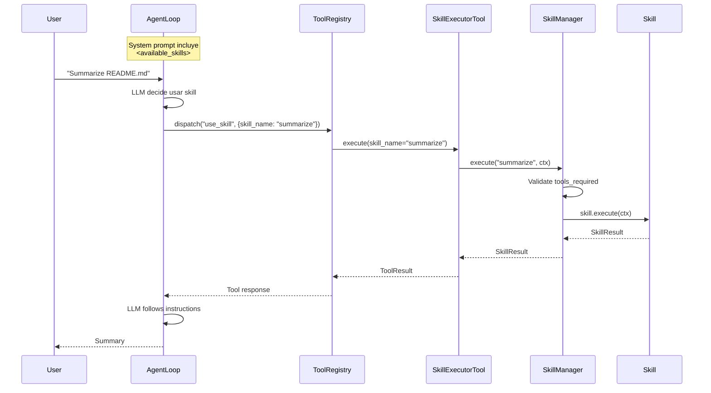

# Skills System: Analysis and Architecture

## Executive Summary

El sistema de Skills de Rumi implementa un patrón de **estrategias reutilizables** que permite extender las capacidades del agente sin modificar su código base. A diferencia de las Tools (capacidades atómicas), los Skills representan flujos de trabajo completos que guían al LLM en tareas complejas.

---

## 1. Motivación

### Problema

Los agentes IA basados en tools enfrentan limitaciones:

1. **Tools son atómicas**: `bash`, `web_fetch` hacen una cosa. Tareas complejas requieren múltiples pasos coordinados.
2. **Context window limitado**: No podemos incluir instrucciones detalladas para todas las tareas posibles.
3. **Conocimiento disperso**: Las mejores prácticas para tareas específicas están en la cabeza del usuario, no del LLM.
4. **Personalización difícil**: Agregar nuevas capacidades requiere modificar código Python.

### Solución: Skills

```
┌─────────────────────────────────────────────────────────────┐
│                     SIN SKILLS                               │
│                                                              │
│  User: "Summarize this file"                                 │
│  LLM: (improvisa cómo hacerlo, puede fallar)                │
│                                                              │
├─────────────────────────────────────────────────────────────┤
│                     CON SKILLS                               │
│                                                              │
│  User: "Summarize this file"                                 │
│  LLM: use_skill("summarize") → recibe instrucciones          │
│  LLM: (sigue instrucciones probadas y optimizadas)          │
└─────────────────────────────────────────────────────────────┘
```

---

## 2. Arquitectura General

```
┌─────────────────────────────────────────────────────────────────────────┐
│                           SKILLS SYSTEM                                  │
│                                                                          │
│  ┌─────────────────────────────────────────────────────────────────┐    │
│  │                        SkillManager                              │    │
│  │                                                                  │    │
│  │  discover()  ────────►  Escanea directorios                     │    │
│  │  register()  ────────►  Registra skill con precedencia          │    │
│  │  match()     ────────►  Busca skills relevantes (scoring)       │    │
│  │  execute()   ────────►  Ejecuta con validación                  │    │
│  │                                                                  │    │
│  │  ┌─────────────────┐  ┌─────────────────┐                       │    │
│  │  │   _registry     │  │    _mtimes      │  Cache + mtime        │    │
│  │  │  {name: Skill}  │  │  {name: float}  │  tracking             │    │
│  │  └─────────────────┘  └─────────────────┘                       │    │
│  └─────────────────────────────────────────────────────────────────┘    │
│                                    │                                     │
│                    ┌───────────────┴───────────────┐                    │
│                    ▼                               ▼                    │
│  ┌──────────────────────────┐    ┌──────────────────────────┐          │
│  │      PromptSkill         │    │       CodeSkill          │          │
│  │                          │    │                          │          │
│  │  SKILL.md only           │    │  SKILL.md + skill.py     │          │
│  │  Returns instructions    │    │  Orchestrates tools      │          │
│  │  LLM follows them        │    │  Calls LLM directly      │          │
│  └──────────────────────────┘    └──────────────────────────┘          │
│                                                                          │
│  ┌─────────────────────────────────────────────────────────────────┐    │
│  │                    SkillExecutorTool                             │    │
│  │                                                                  │    │
│  │  Bridges ToolRegistry ←──────────────────────► SkillManager     │    │
│  │  LLM calls use_skill(skill_name="...")                          │    │
│  └─────────────────────────────────────────────────────────────────┘    │
└─────────────────────────────────────────────────────────────────────────┘
```

### Componentes Principales

| Componente | Responsabilidad |
|------------|-----------------|
| `SkillManager` | Discovery, registro, ejecución, cache |
| `PromptSkill` | Skills declarativos (solo SKILL.md) |
| `CodeSkill` | Skills programáticos (Python) |
| `SkillExecutorTool` | Puente Tool ↔ Skill |
| `SkillsConfig` | Configuración de directorios y settings |

---

## 3. Tipos de Skills

### 3.1 PromptSkill

Skills definidos únicamente por un archivo `SKILL.md`. El contenido se retorna como instrucciones que el LLM debe seguir.

```
my_skill/
└── SKILL.md        ← Único archivo requerido
```

**Estructura SKILL.md:**

```markdown
---
name: summarize
description: Summarize documents extracting key points
version: 1.0.0
tags: [text, analysis, productivity]
tools_required: [bash]
enabled: true
---

# Summarize Skill

When the user asks to summarize a file:

1. Use `bash` to read the file with `cat`
2. Identify the type of content (code, docs, data)
3. Extract key points based on content type
4. Present a structured summary with:
   - Main purpose
   - Key findings
   - Important details
```

**Flujo de ejecución:**



### 3.2 CodeSkill

Skills con lógica Python que pueden orquestar tools y llamar al LLM directamente.

```
my_code_skill/
├── SKILL.md        ← Metadata obligatorio
└── skill.py        ← Lógica Python
```

**Ejemplo skill.py:**

```python
from rumi.skills import CodeSkill, SkillContext, SkillResult

class AnalyzeCodeSkill(CodeSkill):
    """Analyzes code for patterns and issues."""

    async def execute(self, ctx: SkillContext) -> SkillResult:
        # 1. Get file list
        result = await ctx.tools.dispatch("bash", {
            "command": "find . -name '*.py' -type f"
        })

        if not result.success:
            return SkillResult(
                success=False,
                output="",
                error=f"Failed to list files: {result.error}"
            )

        files = result.output.strip().split("\n")

        # 2. Read and analyze each file
        analyses = []
        for file in files[:5]:  # Limit to 5 files
            content = await ctx.tools.dispatch("bash", {
                "command": f"cat {file}"
            })

            if content.success:
                # 3. Use LLM for analysis
                analysis = await ctx.llm.complete(
                    f"Analyze this Python file for issues:\n\n{content.output}"
                )
                analyses.append(f"## {file}\n{analysis}")

        return SkillResult(
            success=True,
            output="\n\n".join(analyses),
            metadata={"files_analyzed": len(analyses)}
        )
```

**Flujo de ejecución:**



### 3.3 Comparación

| Aspecto | PromptSkill | CodeSkill |
|---------|-------------|-----------|
| Complejidad | Baja | Alta |
| Archivos | Solo SKILL.md | SKILL.md + skill.py |
| Control | LLM sigue instrucciones | Python orquesta |
| Flexibilidad | Limitada | Total |
| Llamadas LLM | Delegado al agente | Directas desde código |
| Caso de uso | Guías y workflows simples | Lógica compleja, multi-step |

---

## 4. Sistema de Precedencia

Los skills se descubren de múltiples fuentes con diferente prioridad:



### Directorios

| Source | Path | Priority | Uso |
|--------|------|----------|-----|
| `BUNDLED` | `src/rumi/skills/bundled/` | 1 (baja) | Skills incluidos |
| `USER` | `~/.rumi/skills/` | 2 (media) | Skills personales |
| `WORKSPACE` | `./skills/` | 3 (alta) | Skills del proyecto |

### Ejemplo de Override

```
# Si existe:
bundled/summarize/SKILL.md      (priority=1)
~/.rumi/skills/summarize/SKILL.md  (priority=2)
./skills/summarize/SKILL.md     (priority=3)  ← Este gana

# Solo se registra el de workspace
```

**Código de precedencia:**

```python
def register(self, skill: Skill) -> None:
    existing = self._registry.get(skill.name)

    should_register = existing is None or (
        skill.metadata.source.priority > existing.metadata.source.priority
    )

    if should_register:
        self._registry[skill.name] = skill
```

---

## 5. Discovery y Cache

### Proceso de Discovery

```mermaid
flowchart TD
    A[discover()] --> B[Scan bundled_dir]
    B --> C{SKILL.md exists?}
    C -->|Yes| D[load_skill()]
    C -->|No| B
    D --> E{skill.py exists?}
    E -->|Yes| F[load_code_skill()]
    E -->|No| G[PromptSkill()]
    F --> H[register()]
    G --> H
    H --> I[Repeat for user_dir]
    I --> J[Repeat for workspace_dir]
    J --> K[Return discovered list]
```

### Sistema de Cache (mtime tracking)

El SkillManager mantiene un cache basado en mtime para eficiencia:

```python
class SkillManager:
    def __init__(self):
        self._registry: dict[str, Skill] = {}
        self._mtimes: dict[str, float] = {}      # skill_name -> mtime
        self._skill_paths: dict[str, Path] = {}  # skill_name -> path

    def refresh_changed(self) -> list[str]:
        """Solo recarga skills modificados."""
        reloaded = []

        for name, skill_dir in self._skill_paths.items():
            current_mtime = (skill_dir / "SKILL.md").stat().st_mtime
            cached_mtime = self._mtimes.get(name, 0)

            if current_mtime > cached_mtime:
                # Reload only this skill
                new_skill = self.load_skill(skill_dir)
                self._registry[name] = new_skill
                self._mtimes[name] = current_mtime
                reloaded.append(name)

        return reloaded
```

**Beneficios:**

- `discover()`: Full scan (startup)
- `refresh_changed()`: Incremental (hot reload)
- `refresh()`: Clear cache + full scan
- Sin polling innecesario

---

## 6. Matching y Scoring

El sistema puede sugerir skills relevantes basado en la query del usuario:

```python
def matches_keywords(self, query: str) -> float:
    """Calcula relevancia 0.0 a 1.0"""
    query_lower = query.lower()
    score = 0.0

    # Nombre en query (señal fuerte)
    if self.name.lower() in query_lower:
        score += 0.5

    # Palabras en descripción
    desc_lower = self.description.lower()
    query_words = query_lower.split()
    matching = sum(1 for w in query_words if w in desc_lower)
    score += 0.3 * (matching / len(query_words))

    # Tags
    for tag in self.tags:
        if tag.lower() in query_lower:
            score += 0.2
            break

    return min(score, 1.0)
```

**Uso:**

```python
matches = manager.match("summarize this file", threshold=0.1)
# → [(summarize_skill, 0.7), (explain_skill, 0.2)]
```

---

## 7. Integración con el Sistema

### Flujo Completo



### Generación de Prompt

El SkillManager genera un bloque XML para el system prompt:

```python
def get_available_skills_prompt(self) -> str:
    skills = self.list_skills(include_disabled=False)

    lines = ["<available_skills>"]
    for meta in skills[:self.config.max_skills_in_prompt]:
        lines.append("<skill>")
        lines.append(f"  <name>{meta.name}</name>")
        lines.append(f"  <description>{meta.description}</description>")
        lines.append("</skill>")
    lines.append("</available_skills>")

    return "\n".join(lines)
```

**Output:**

```xml
<available_skills>
<skill>
  <name>summarize</name>
  <description>Summarize documents extracting key points</description>
</skill>
<skill>
  <name>explain</name>
  <description>Explain how code works</description>
</skill>
</available_skills>
```

---

## 8. Validación de Tools

Antes de ejecutar un skill, se valida que las tools requeridas estén disponibles:

```python
async def execute(self, name: str, ctx: SkillContext) -> SkillResult:
    # Validate required tools
    available_tools = ctx.tools.list_tools()
    missing_tools = self.get_missing_tools(name, available_tools)

    if missing_tools:
        return SkillResult(
            success=False,
            error=f"Skill '{name}' requires unavailable tools: {', '.join(missing_tools)}"
        )

    return await skill.execute(ctx)
```

---

## 9. CLI de Skills

```bash
# Listar skills disponibles
rumi skills list
rumi skills list --all  # Incluir deshabilitados

# Ver detalles de un skill
rumi skills info summarize

# Habilitar/deshabilitar
rumi skills enable my_skill
rumi skills disable my_skill

# Crear desde template
rumi skills create my_skill
rumi skills create my_skill --code  # Con skill.py
rumi skills create my_skill -d "Description"
```

---

## 10. Beneficios del Approach

### 10.1 Separación de Concerns

```
┌─────────────────────────────────────────────────────────────┐
│                    RESPONSABILIDADES                         │
├─────────────────────────────────────────────────────────────┤
│  Tools          │  Capacidades atómicas (bash, web_fetch)   │
│  Skills         │  Estrategias y workflows                   │
│  Agent          │  Orquestación y decisiones                │
│  LLM            │  Razonamiento y generación                │
└─────────────────────────────────────────────────────────────┘
```

### 10.2 Extensibilidad sin Código

| Acción | Sin Skills | Con Skills |
|--------|------------|------------|
| Agregar workflow | Modificar agent.py | Crear SKILL.md |
| Personalizar | Fork del repo | ~/.rumi/skills/ |
| Por proyecto | Hardcoded | ./skills/ |
| Actualizar | Redeploy | Editar archivo |

### 10.3 Knowledge Capture

Los skills capturan conocimiento experto:

```markdown
# code_review/SKILL.md

When reviewing code:

1. Check for security issues:
   - SQL injection
   - XSS vulnerabilities
   - Hardcoded secrets

2. Check for best practices:
   - Error handling
   - Input validation
   - Type hints

3. Check for performance:
   - N+1 queries
   - Unbounded loops
   - Memory leaks
```

Este conocimiento:
- Se reutiliza en cada ejecución
- Se puede versionar (git)
- Se puede compartir
- Se puede mejorar incrementalmente

### 10.4 Hot Reload

```python
# Durante desarrollo:
manager.refresh_changed()  # Solo recarga lo modificado
```

No requiere reiniciar el agente para probar cambios.

### 10.5 Testabilidad

```python
# PromptSkills son fáciles de testear
def test_summarize_skill():
    skill = PromptSkill(Path("skills/summarize"))

    # Verificar metadata
    assert skill.name == "summarize"
    assert "bash" in skill.metadata.tools_required

    # Verificar instrucciones
    result = await skill.execute(mock_ctx)
    assert "key points" in result.output
```

### 10.6 Composabilidad

CodeSkills pueden llamar otros skills:

```python
class ComplexReviewSkill(CodeSkill):
    async def execute(self, ctx: SkillContext) -> SkillResult:
        # Ejecutar otro skill
        summary = await ctx.tools.dispatch("use_skill", {
            "skill_name": "summarize"
        })

        # Luego hacer el review
        review = await ctx.tools.dispatch("use_skill", {
            "skill_name": "code_review"
        })

        return SkillResult(
            success=True,
            output=f"# Summary\n{summary.output}\n\n# Review\n{review.output}"
        )
```

---

## 11. Comparación con Alternativas

### 11.1 vs. Prompts Hardcodeados

| Aspecto | Hardcoded | Skills |
|---------|-----------|--------|
| Ubicación | En código Python | Archivos separados |
| Edición | Requiere deploy | Hot reload |
| Override | Fork del repo | Directorios de usuario |
| Versionado | Con el código | Independiente |

### 11.2 vs. RAG (Retrieval Augmented Generation)

| Aspecto | RAG | Skills |
|---------|-----|--------|
| Precisión | Fuzzy retrieval | Exact matching |
| Latencia | Query + embedding | Instantáneo (cache) |
| Control | Probabilístico | Determinístico |
| Estructura | Documentos | Workflows |

### 11.3 vs. Fine-tuning

| Aspecto | Fine-tuning | Skills |
|---------|-------------|--------|
| Costo | Alto (GPU, datos) | Bajo (archivos) |
| Flexibilidad | Requiere re-train | Edición inmediata |
| Transparencia | Caja negra | Instrucciones claras |
| Mantenimiento | Complejo | Simple |

---

## 12. Patterns y Anti-Patterns

### Patterns Recomendados

```markdown
# ✅ Skill específico y enfocado
name: git_commit
description: Create well-formatted git commits

# ✅ Instrucciones step-by-step
1. Check git status
2. Stage relevant files
3. Write commit message following conventional commits
4. Create commit

# ✅ Declarar tools_required
tools_required: [bash]
```

### Anti-Patterns

```markdown
# ❌ Skill demasiado genérico
name: do_everything
description: Does everything

# ❌ Instrucciones vagas
Just do the task well.

# ❌ No declarar dependencias
# (falla en runtime si bash no está disponible)
```

---

## 13. Seguridad

### Trust Model

El sistema sigue un modelo **trust-on-install**:

- Los skills del usuario (`~/.rumi/skills/`) son confiables
- Similar a `pip install` - el usuario decide qué instalar
- CodeSkills ejecutan Python arbitrario

### Mitigaciones

1. **Aislamiento**: CodeSkills no tienen acceso directo al sistema de archivos (excepto vía tools)
2. **Validación de tools**: Se verifica que tools_required estén disponibles
3. **Logging**: Todas las ejecuciones se registran
4. **Precedencia clara**: El usuario puede override cualquier skill bundled

---

## 14. Futuras Extensiones

### 14.1 Skill Marketplace

```bash
rumi skills install community/awesome-summarize
rumi skills search "code review"
```

### 14.2 Skill Chaining Declarativo

```yaml
# SKILL.md
chain:
  - skill: summarize
  - skill: translate
    config:
      target_language: es
```

### 14.3 Skill Versioning

```yaml
name: summarize
version: 2.0.0
requires_rumi: ">=0.2.0"
```

### 14.4 Skill Analytics

```python
manager.get_usage_stats("summarize")
# → {"executions": 42, "success_rate": 0.95, "avg_duration_ms": 1200}
```

---

## 15. Conclusión

El sistema de Skills de Rumi proporciona:

1. **Extensibilidad**: Agregar capacidades sin código
2. **Personalización**: Override por usuario y proyecto
3. **Conocimiento capturado**: Workflows probados y reutilizables
4. **Simplicidad**: PromptSkills son solo Markdown
5. **Potencia**: CodeSkills para lógica compleja
6. **Performance**: Cache con mtime tracking

Es un balance entre la flexibilidad de prompts y la estructura de código, permitiendo que tanto usuarios técnicos como no técnicos extiendan las capacidades del agente.
